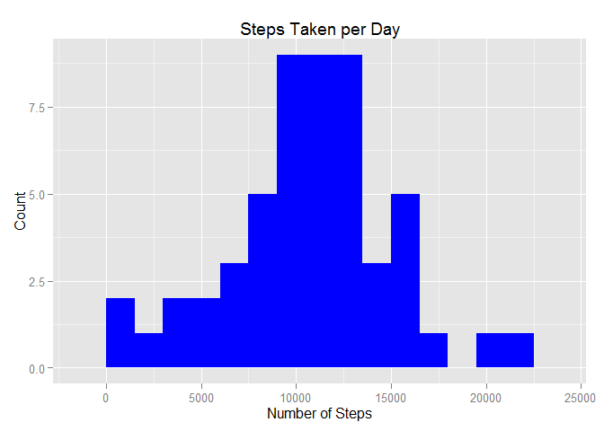
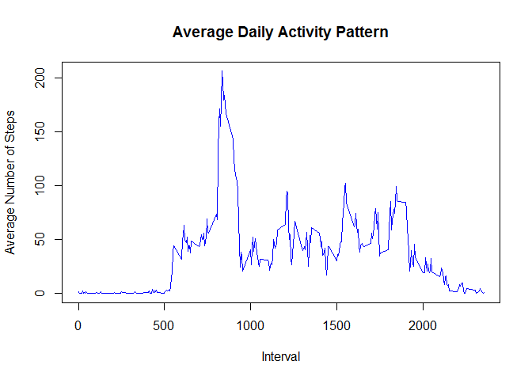
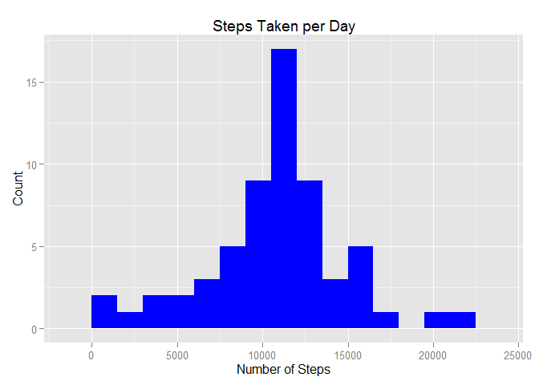
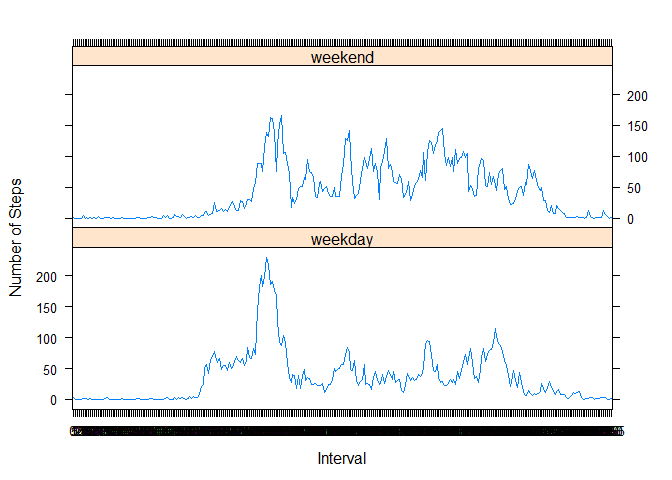

# Reproducible Research: Peer Assessment 1
## Setup
This section of code is required for setup of the rest of the analysis

Define the name of the zip file and download location:

```r
data_file_name <- "activity.zip"
file_url <- "https://d396qusza40orc.cloudfront.net/repdata%2Fdata%2Factivity.zip"
```

Download the data if it doesn't already exist:

```r
if(!file.exists(data_file_name)){
    print("Downloading Data")
    download.file(file_url,data_file_name, mode = "wb")
}
```

Unzip the data if it hasn't already been unzipped:

```r
if(!file.exists("activity.csv")){
    print("Unzipping activity.csv")
    unzip(data_file_name,files="activity.csv")
}
```

Install and load the 'ggplot2' and 'lattice' libraries if it isn't already 
installed and loaded:

```r
if(!is.element("ggplot2", installed.packages()[,1])){
    print("Installing ggplot2 package")
    install.packages("ggplot2")
}
library(ggplot2)

if(!is.element("lattice", installed.packages()[,1])){
    print("Installing lattice package")
    install.packages("lattice")
}
library(lattice)
```

## Loading and preprocessing the data
Use read.csv to load the data:

```r
act_data <- read.csv("activity.csv")
```

Now format the data appropriately:

```r
act_data$date <- as.Date(act_data$date, format = "%Y-%m-%d")
act_data$interval <- factor(act_data$interval)
```

## What is mean total number of steps taken per day?
Aggregate the total number of steps taken per day:

```r
steps_per_day <- aggregate(steps ~ date, act_data, sum)
```

Add descriptive headers to the aggregated steps taken per day:

```r
colnames(steps_per_day) <- c("date", "steps")
```

Plot the data in a histogram using 'ggplot':

```r
ggplot(steps_per_day, aes(x = steps)) + 
    geom_histogram(fill = "blue", binwidth = 1500) + 
    labs(title = "Steps Taken per Day", x = "Number of Steps", y = "Count")
```

 

Calculate and report the mean and median of the total number of steps taken per 
day:

```r
mean(steps_per_day$steps)
```

```
## [1] 10766.19
```

```r
median(steps_per_day$steps)
```

```
## [1] 10765
```


## What is the average daily activity pattern?
Make a time series plot (i.e. type = "l") of the 5-minute interval (x-axis) 
and the average number of steps taken, averaged across all days (y-axis):

```r
steps_per_interval <- aggregate(act_data$steps, 
                                by=list(interval=act_data$interval), 
                                FUN=mean, 
                                na.rm=TRUE)
colnames(steps_per_interval) <- c("interval", "average_steps")
plot(as.integer(levels(steps_per_interval$interval)), 
     steps_per_interval$average_steps, type="l",
     xlab = "Interval", 
     ylab = "Average Number of Steps", 
     main = "Average Daily Activity Pattern",  
     col ="blue")
```

 

Which 5-minute interval, on average across all the days in the dataset, contains 
the maximum number of steps?

```r
max_steps_interval<-steps_per_interval[which.max(steps_per_interval$average_steps),]$interval
print(max_steps_interval)
```

```
## [1] 835
## 288 Levels: 0 5 10 15 20 25 30 35 40 45 50 55 100 105 110 115 120 ... 2355
```
Interval 835 contains the maximum number of steps

## Imputing missing values
Calculate and report the total number of missing values in the dataset (i.e. the 
total number of rows with NAs):

```r
table(is.na(act_data))
```

```
## 
## FALSE  TRUE 
## 50400  2304
```
There are 2304 missing values.  

Devise a strategy for filling in all of the missing values in the dataset. 
The strategy does not need to be sophisticated.  

Strategy: Replace using the mean of the same interval:

```r
act_data_nas <- which(is.na(as.character(act_data$steps)))
```

Create a new dataset that is equal to the original dataset but with the missing 
data filled in:

```r
act_data_new <- act_data
act_data_new[act_data_nas, ]$steps<-unlist(lapply(act_data_nas, FUN=function(act_data_nas){
    steps_per_interval[act_data[act_data_nas,]$interval==steps_per_interval$interval,]$average_steps
}))
```

Make a histogram of the total number of steps taken each day with the replaced 
values. Plot using ggplot:

```r
steps_per_day_new <- aggregate(steps ~ date, act_data_new, sum)
ggplot(steps_per_day_new, aes(x = steps)) + 
    geom_histogram(fill = "blue", binwidth = 1500) + 
    labs(title = "Steps Taken per Day", x = "Number of Steps", y = "Count")
```

 

Calculate and report the mean and median total number of steps taken per day:

```r
mean(steps_per_day_new$steps)
```

```
## [1] 10766.19
```

```r
median(steps_per_day_new$steps)
```

```
## [1] 10766.19
```

Do these values differ from the estimates from the first part of the assignment? 
What is the impact of imputing missing data on the estimates of the total daily 
number of steps?  
Yes, it has an impact on the median. Replacing the missing data has made the 
median now equal to the mean.

## Are there differences in activity patterns between weekdays and weekends?
First, add a new column to the data set that specifies weedays and weekends:

```r
act_data_new$day_of_week <- (weekdays(as.Date(act_data_new$date, "%Y-%m-%d")) %in% 
                               c("Saturday", "Sunday"))
for (i in 1:nrow(act_data_new)) {
    if (act_data_new$day_of_week[i]) {
        act_data_new$day_of_week[i] <- "weekend"
    } else {
        act_data_new$day_of_week[i] <- "weekday"
    }
}
```
Second, aggregate the steps per interval for weekday and weekend:

```r
act_data_new$day_of_week <- factor(act_data_new$day_of_week)
steps_per_interval_dow <- aggregate(steps ~ interval + day_of_week, 
                                    act_data_new, FUN = mean, 
                                    na.rm = TRUE)
```

Now, plot the data using xyplot:

```r
xyplot(steps ~  interval | day_of_week, data = steps_per_interval_dow, 
       layout = c(1,2), 
       type ="l", 
       ylab="Number of Steps",
       xlab="Interval")
```

 
  
Weekday activity has a spike in the morning and then stays relatively lower 
compared to weekends.  Weekend activity starts later than weekdays but seems to 
be more constant throughout the day.
